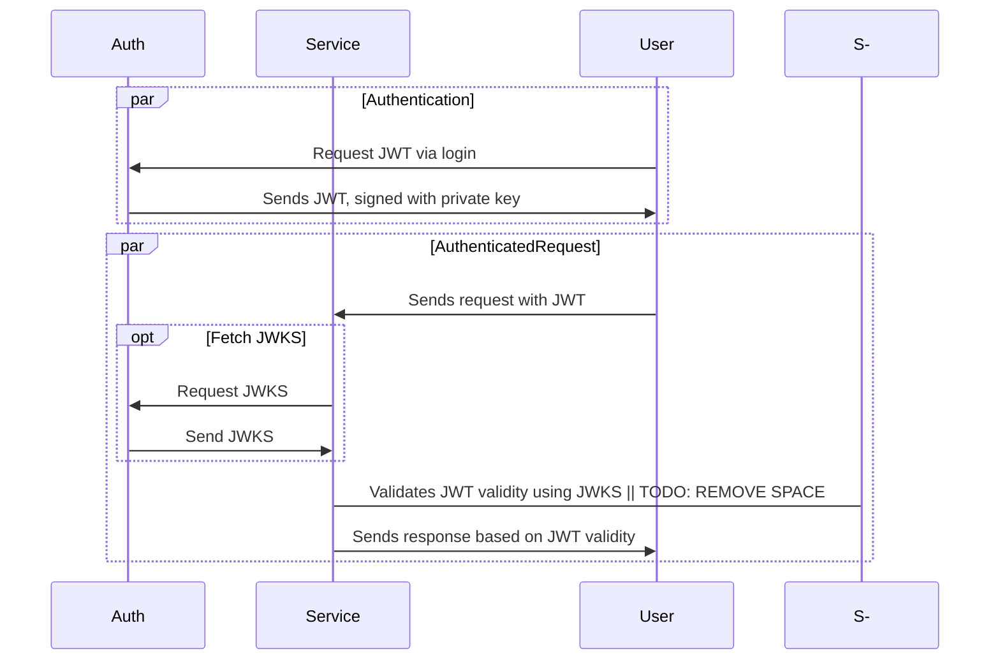

+++
date = "2025-04-16"
title = "Creating and validating JWTs with public/private keys (JSON Web Key Set, JWKS)"
slug = "creating-jwt-with-public-private-keys-jwk"
tags = ["JWT", "Security", "Encryption", "Golang", "Typescript"]
categories = ["Backend"]
[params]
  metadescription = "How to securely sign and validate JWTs using public/private key pairs and leverage JSON Web Key Set (JWKS)"
  metakeywords = 'jwt, jwk, jwks, public private key, authentication, jose, token validation'
+++

_This article discusses an implementation of JWT generation in Go, and validation in Go and Typescript. The library used for this, jose, has implementations for many other programming languages, so the principles can be applied in nearly all commonly used programming languages._

JSON Web Token[^jwtrfc] (JWT for short) is a very commonly used way to create and validate authentication tokens on the web. This article is not a tutorial of JWT basics, there are many resources available for that online already.

Most often, when generating JWTs, a secret value is used to create the third part of the JWT, the signature. This approach is great when there is a single service that generates and validates tokens. In some cases though, you want to sign a token on one service, and have it validated by another service. This could be achieved by sharing the signing secret, but this is not an optimal solution in terms of security, you would rather sign a JWT on one service and then validate it on another service, in a way that doesn't require you to have access to the secret value.

This can be achieved by using private/public key encryption. You can sign a JWT with a private key, and in the header include the link to where the public key can be found to validate the signature. This will allow other services to validate a JWT, without requiring access to the actual secret value to sign a key. To make this more concrete: this system is used by for example Auth0[^authzero] to sign keys to then allow you to validate these tokens without needing access to the signing secret. This system is also used by AWS Cognito[^awscognito].

I recently integrated this into [Capsa.gg](https://capsa.gg). The web panel has middleware to validate JWTs, which will redirect a user to log in if the key is invalid. When I started implementing this, I was not able to find a lot of resources on this unfortunately and it took quite some trial-and-error to complete. Yet in the end, implementing JWTs with private key signing and public key validation was quite straight-forward. Hence why I'm sharing my findings here, in the hope it will be useful to others.

This article will implement JWT generation with a private key and gives an example of validating with the private key. Some code is omitted, a working example project can be found on Github: [lucianonooijen/jwt-public-private-key-demo](https://github.com/lucianonooijen/jwt-public-private-key-demo). This also contains some unit tests for validation, which are not included in this article.

> [!CAUTION]+ Security disclaimer
> Please don't follow this guide as if it's gospel, make sure you know what you are doing. This article and the example project are meant as starting points, to be adopted according to specific needs. Never blindly trust code on the internet, especially when it comes to security. The footnotes of this article contain trusted sources that can be used for further reading.

[^jwtrfc]: [RFC7519](https://datatracker.ietf.org/doc/html/rfc7519)

[^authzero]: [Auth0 JSON Web Key Sets](https://auth0.com/docs/secure/tokens/json-web-tokens/json-web-key-sets)

[^awscognito]: [AWS Cognito Token Validation](https://docs.aws.amazon.com/cognito/latest/developerguide/amazon-cognito-user-pools-using-tokens-verifying-a-jwt.html#amazon-cognito-user-pools-using-tokens-aws-jwt-verify)

## JSON Web Key

When generating a JWT, the first part of the token, the header, contains information about how the key is signed. The most important field for our use-case, is the algorithm field `alg`.

For example, when signing a token with just a simple secret, the header contents are

```json
{
  "alg": "HS256",
  "typ": "JWT"
}
```

indicating that the algorithm used is "HMAC using SHA-256"[^hs256]. This is the easiest way to sign and verify JWTs, used in many projects. You need a secret to sign the token, and use the same token to validate it.

Now let's look at the header of a JWT that has been signed with the public/private key setup that this article discusses:

```json
{
  "alg": "RS256",
  "jku": "http://localhost:4000/.well-known/jwks.json",
  "typ": "JWT"
}
```

The algorithm field here now has a different value, `RS256`, indicating the digital signature algorithm used is "RSASSA-PKCS1-v1_5 using SHA-256"[^rs256].

This looks like a cat walked across the keyboard, but we can break this down. `RSA` indicates that we are using RSA, so a public/private key setup, `SSA` indicates "With Appendix", meaning the signature is separate from the message, which makes sense with how JWTs work. `PKCS1` refers to the "Public-Key Cryptography Standards #1"[^pkcsone], which defines how RSA should be used. `v1_5` indicates the padding scheme, which is older, but used and supported in JWTs.

A new field in the header, is the `jku` field. This is the JWK Set URL[^jku], often being `<service_url>/.well-known/jwks.json`[^jwksuri]. The URL here should resolve to the public key data when making a GET request to this URL over TLS[^jku-optional]. The value of this field should not be blindly trusted at runtime unless it matches an expected value, or there is the risk of a key injection attack. When fetching this URL, there is a specific format how the data should be encoded[^jwkformat], which is called the JSON Web Key Set, or JWKS. "Set" here meaning a collection of multiple JSON Web Keys (singular: JWK). We will discuss this a bit more later. The important takeaway here is: this URL contains the public key data of all signing keys that should be considered valid.

A small note to add: for the example project, we are not fully following the RFC, as we fetch the JWKS without TLS. When implementing a JWKS endpoint, it should always be to over TLS to follow the RFC[^jku].

To summarize: when implementing public/private key signing for JWTs, the JWT should contain the correct algorithm, as well as a URL where valid keys can be retrieved for validating the tokens. There is a specific format on how the public keys must be made available.

<!--
mmdc -i mermaid.mmd -o static/img/0011-1.png -b transparent

-->


[^pkcsone]: [RFC8017](https://datatracker.ietf.org/doc/html/rfc8017)

[^jwkformat]: [RFC7517: JSON Web Key (JWK) Format](https://datatracker.ietf.org/doc/html/rfc7517#section-4)

[^hs256]: [RFC7518: HMAC with SHA-2 Functions](https://datatracker.ietf.org/doc/html/rfc7518#section-3.2)

[^rs256]: [RFC7519: Digital Signature with RSASSA-PKCS1-v1_5](https://datatracker.ietf.org/doc/html/rfc7518#section-3.1)

[^jku]: [RFC7515: "jku" (JWK Set URL) Header Parameter](https://datatracker.ietf.org/doc/html/rfc7515#section-4.1.2)

[^jwksuri]: This is not a strict requirement for our use-case here, but comes from the conventions for OAuth2.0 Authorization Server Metadata. This is also the endpoint used by Auth0 and AWS Cognito. See [RFC8414: Authorization Server Metadata](https://datatracker.ietf.org/doc/html/rfc8414#section-2) for more info.

[^jku-optional]: The RFC marks this field as optional but for our use-case we want to include this field.

## Public/private key generation

So, let's start implementing JWT signing with public/private keys. The first thing we need, is to actually generate the keys. We need to generate keys with at least 2048 bits[^keysize].

We don't want to generate a key, keep it in memory and use that right away. The keys should be reused if the application starts up. You can generate the key in any way you like, this is an example of how to do this in Go. Let's assume we want to create a private key, then extract the public key from that, encode that as strings that we will return to the calling function, which will write the keys to disk.

```go
package token

import (
	"crypto/rand"
	"crypto/rsa"
	"crypto/x509"
	"encoding/pem"
	"fmt"
)

// RsaKeySet is a set of generated public and private keys.
type RsaKeySet struct {
	PrivateKey []byte
	PublicKey  []byte
}

// GenerateRsaKeySet generates a private/public key set for signing JWKs.
func GenerateRsaKeySet() (*RsaKeySet, error) {
	privateKey, err := rsa.GenerateKey(rand.Reader, 4096)
	if err != nil {
		return nil, fmt.Errorf("error generating private key: %w", err)
	}

	return EncodePrivateKeyToBytes(privateKey)
}

// EncodePrivateKeyToBytes takes in a *rsa.PrivateKey and encodes this to the private and public PEM key bytes.
func EncodePrivateKeyToBytes(privateKey *rsa.PrivateKey) (*RsaKeySet, error) {
	privateKeyBytes := encodePrivateKeyToPEM(privateKey)

	publicKeyBytes, err := encodePublicKeyToPem(privateKey)
	if err != nil {
		return nil, fmt.Errorf("error generating public key: %w", err)
	}

	keyData := RsaKeySet{
		PrivateKey: privateKeyBytes,
		PublicKey:  publicKeyBytes,
	}

	return &keyData, nil
}

func encodePrivateKeyToPEM(privateKey *rsa.PrivateKey) []byte {
	// Get PKCS #1, ASN.1 DER format
	privateKeyContents := x509.MarshalPKCS1PrivateKey(privateKey)

	// pem.Block
	privateBlock := pem.Block{
		Type:    "RSA PRIVATE KEY",
		Headers: nil,
		Bytes:   privateKeyContents,
	}

	// Private key in PEM format
	privatePEM := pem.EncodeToMemory(&privateBlock)

	return privatePEM
}

func encodePublicKeyToPem(privateKey *rsa.PrivateKey) ([]byte, error) {
	// Extract the public key
	publicKey := &privateKey.PublicKey

	// Marshal the public key to PKIX, ASN.1 DER form
	publicKeyBytes, err := x509.MarshalPKIXPublicKey(publicKey)
	if err != nil {
		return nil, fmt.Errorf("error marshaling public key: %w", err)
	}

	// Create the PEM block
	publicKeyPEMBlock := pem.Block{
		Type:  "PUBLIC KEY",
		Bytes: publicKeyBytes,
	}

	// Encode the PEM block to []byte
	publicKeyPEM := pem.EncodeToMemory(&publicKeyPEMBlock)

	return publicKeyPEM, nil
}
```

_Security disclaimer: keys must be handled with care. You need to use different keys for different environments and have proper practices for handling secrets. Please make sure you handle key generation and storage with great care._

[^keysize]: [RFC7518: Digital Signature with RSASSA-PKCS1-v1_5](https://datatracker.ietf.org/doc/html/rfc7518#section-3.3)

## Accessing the public and private key

So we have generated a private and public key and persisted the contents to disk. Let's now work on the actual JWT logic that uses these keys. In practice, we don't need to load the public key from disk, only the private key, which we will use to get the public key values.

So let's write two helper functions: one that will load the private key from disk, and another that will decode a base64 string that is passed into it, for example if the private key value is set as an environment variable, base64 encoded.

```go
package token

import (
	"crypto/rsa"
	"crypto/x509"
	"encoding/base64"
	"encoding/pem"
	"errors"
	"fmt"
	"os"
)

const blockTypeRsaPrivateKey = "RSA PRIVATE KEY"

var (
	// ErrorPemPrivateKeyDecoding indicates that the decoding of the private-key containing PEM block failed.
	ErrorPemPrivateKeyDecoding = errors.New("failed to decode PEM block containing private key")
)

// LoadPrivateKeyFromPath reads the private key from a file and returns a rsa.PrivateKey struct.
func LoadPrivateKeyFromPath(path string) (*rsa.PrivateKey, error) {
	// Read the file
	keyBytes, err := os.ReadFile(path) //nolint:gosec // "G304: Potential file inclusion via variable", this path is set in the config.yml and should never contain user input
	if err != nil {
		return nil, fmt.Errorf("failed to read private key file: %w", err)
	}

	// Decode the PEM block
	block, _ := pem.Decode(keyBytes)
	if block == nil || block.Type != blockTypeRsaPrivateKey {
		return nil, ErrorPemPrivateKeyDecoding
	}

	// Parse the private key
	privateKey, err := x509.ParsePKCS1PrivateKey(block.Bytes)
	if err != nil {
		return nil, fmt.Errorf("failed to parse private key: %w", err)
	}

	return privateKey, nil
}

// LoadPrivateKeyFromBase64String reads the private key from a base64 string and returns a rsa.PrivateKey struct.
func LoadPrivateKeyFromBase64String(b64 string) (*rsa.PrivateKey, error) {
	keyBytes, err := base64.StdEncoding.DecodeString(b64)
	if err != nil {
		return nil, fmt.Errorf("failed to decode private key base64 string: %w", err)
	}

	// Decode the PEM block
	block, _ := pem.Decode(keyBytes)
	if block == nil || block.Type != blockTypeRsaPrivateKey {
		return nil, ErrorPemPrivateKeyDecoding
	}

	// Parse the private key
	privateKey, err := x509.ParsePKCS1PrivateKey(block.Bytes)
	if err != nil {
		return nil, fmt.Errorf("failed to parse private key: %w", err)
	}

	return privateKey, nil
}
```

We now have our `*rsa.PrivateKey` instance again that we can use to sign JWTs with.

## Signing JWTs

To sign the JWTs, we will be using go-jose[^gojose]. Let's create a struct called `Token`, which holds the data we need, and exposes methods to sign and validate tokens:

```go
import (
	"crypto/rsa"
	"errors"
	"fmt"

	"github.com/go-jose/go-jose/v4"
)

type Token struct {
	privateKey *rsa.PrivateKey
	jwk        *jose.JSONWebKey
	signer     *jose.Signer
}
```

With our `Token` struct defined, let's create a function called `New` in our package, that will accept a private key and returns an initialized `Token` instance:

```go
const (
	keyID     = "jwt-demo-server-jwk"
	algorithm = jose.RS256
)

// New returns a Token instance after validating the *rsa.PrivateKey.
func New(pk *rsa.PrivateKey) (*Token, error) {
	if pk == nil {
		return nil, errors.New("private key argument is required")
	}

	if err := pk.Validate(); err != nil {
		return nil, fmt.Errorf("error validating private key: %w", err)
	}

	jwk := jose.JSONWebKey{
		Key:       pk,
		Use:       "sig",
		Algorithm: string(algorithm),
		KeyID:     keyID,
	}

	signerOptions := (&jose.SignerOptions{}).
		WithHeader("alg", algorithm).
		WithHeader("typ", "JWT").
		WithHeader("jku", "http://localhost:4000/.well-known/jwks.json")

	jwtSigner, err := jose.NewSigner(jose.SigningKey{
		Algorithm: algorithm,
		Key:       pk,
	}, signerOptions)

	if err != nil {
		return nil, fmt.Errorf("error creating jwt signer: %w", err)
	}

	jwkInstance := Token{
		privateKey: pk,
		jwk:        &jwk,
		signer:     &jwtSigner,
	}

	return &jwkInstance, nil
}
```

A few important notes here: the `keyID` is an identifier for which type of key we are dealing with. If you have two token types: a user and an admin, you want to use different key IDs, which other services should validate if it's the right `keyID`. The `jku` field is now hardcoded in this example, you will most likely need to add a method that uses the application config to generate the correct URL, which is using `https`, not `http` like in this example. In the `jose.JSONWebKey`, we set `Use: "sig"`, because we use this key for signing, not for encrypting the JWT[^useparam], that is beyond the scope of this article.

With our new `Token` instance, let's add a few methods that allows us to actually generate and validate JWTs. For our example application, we will only have a single token type. When dealing with multiple token types, you will most likely have to generate multiple functions for generation and validation, for each token type.

Let's generate a JWT:

```go
const (
	Audience = "example"
	Issuer = "jwt-demo-server"
)


func (t *Token) GenerateJwt(subject, jwtId, name, role string) (string, error) {
	now := time.Now()
	expiryHours := time.Duration(48) * time.Hour

	claims := JwtClaims{
		Issuer:    Issuer,
		Subject:   subject,
		Audience:  Audience,
		Expiry:    now.Add(expiryHours).Unix(),
		NotBefore: now.Unix(),
		IssuedAt:  now.Unix(),
		JwtID:     jwtId,
		Name:      name,
		Role:      role,
	}

	tok, err := t.generateTokenForClaims(claims)
	if err != nil {
		return "", fmt.Errorf("error signing token: %w", err)
	}

	log.Printf("generated client jwt with subject: %s\n", subject)

	return tok, nil
}

// generateTokenForClaims is a function that will sign the JwtClaims passed in.
// WARNING: This method should only be called in public wrapper functions and not exposed directly.
// For generating tokens in production code, always use the audience-specific methods.
func (t *Token) generateTokenForClaims(claims JwtClaims) (string, error) { //nolint:gocritic // Jose needs val, not ref
	return jwt.Signed(*t.signer).Claims(claims).Serialize()
}
```

The scary looking second function performs the logic to actually generate the JWT string with the claims passed in. Discussing the JWT claims is beyond the scope of this article, these are explained in the RFC[^jwtrfc]. An example can be found [in the example project](https://github.com/lucianonooijen/jwt-public-private-key-demo/blob/main/server/internal/token/claims.go). The note "For generating tokens in production code, always use the audience-specific methods." refers to using wrapper functions to generate keys with the correct data.

[^gojose]: [go-jose/go-jose](https://github.com/go-jose/go-jose/)

[^useparam]: [RFC7517: "use" (Public Key Use) Parameter](https://datatracker.ietf.org/doc/html/rfc7517#section-4.2)

## Validating JWTs using the private key

Of course we also want to be able to validate the JWT on the service that generated the key. Let's add that before we implement the validation on an external service:

```go
var (
	// ErrorJwtParsing indicates that the signature of the JWT is not valid.
	ErrorJwtParsing = errors.New("parsing JWT failed")

	// ErrorJwtValidation indicates that the token claims could not be validated.
	ErrorJwtValidation = errors.New("claim validation for JWT failed")

	// ErrorJwtConversion indicates that the token claims to struct conversion failed.
	ErrorJwtConversion = errors.New("claim conversion for JWT failed")
)

func (t *Token) ValidateJwt(token string) (*JwtClaims, error) {
	parsedToken, err := jwt.ParseSigned(token, []jose.SignatureAlgorithm{algorithm})
	if err != nil {
		log.Printf("error parsing signed token: %s\n", err)

		return nil, ErrorJwtParsing
	}

	claims := Claims{}

	// Note: dereference here is very important!
	// The jose code checks for *rsa.PublicKey specifically, and does not accept rsa.PublicKey
	err = parsedToken.Claims(&t.privateKey.PublicKey, &claims)
	if err != nil {
		log.Printf("error validating token claims: %s\n", err)

		return nil, ErrorJwtValidation
	}

	c, err := claims.jwtClaims()
	if err != nil {
		log.Printf("error converting token claims: %s\n", err)

		return nil, ErrorJwtConversion
	}

	err = validateJwtClaims(c)
	if err != nil {
		log.Printf("error validating token claims: %s\n", err)

		return nil, err
	}

	return c, nil
}

```

This code assumes a `type Claims map[string]any` definition. On this type, we add a method `jwtClaims` that converts this map to our own custom claims type, which was mentioned before. For inspiration, you can check [this example](https://github.com/lucianonooijen/jwt-public-private-key-demo/blob/main/server/internal/token/claims.go). We also call our own `validateJwtClaims` method, which is beyond the scope of this article, but it validates a bunch of fields, you can draw inspiration from [this example](https://github.com/lucianonooijen/jwt-public-private-key-demo/blob/main/server/internal/token/jwt_validate_claims.go). The validation required depends on your application. You should also validate that the algorithm and key id match the expected values, or reject the token if they don't.

## Sharing the public key

Remember that when signing tokens with RS256 (public/private key setup), that we should include a URL where the JWKS can be retrieved? Let's add that now.

In our `Token` instance, we want to add a method that allows us to retrieve the JSON representation of the public key. Getting the JSON representation of the public key is very straight-forward:

```go
// GetPublicKey takes the public part of the private key and marshals this to JSON for the .well-known/jwks.json endpoint.
func (t *Token) GetPublicKey() ([]byte, error) {
	// SECURITY NOTE: NEVER REMOVE `.Public()` FROM THIS CODE
	// Otherwise, the private key will be shared and the whole token system will be compromised!
	return t.jwk.Public().MarshalJSON()
}
```

**Make sure you use `jwk.Public()`!** If you do not include the `Public()` part in here, you will expose the full _private_ key, meaning the whole token system will be compromised!

We can add a simple handler to return this key like this, assuming we have our handlers in a `handlers` struct which has an instance of `Token` in the `token` struct field:

```go
func (h *handlers) Jwk(c *gin.Context) {
	pubKey, err := h.token.GetPublicKey()
	if err != nil {
		// handle error
		return
	}

	c.Header("content-type", "application/json")

	// Manually writing JSON for compatibility with the []byte from pubKey
	c.Writer.WriteString(`{"keys":[`) //nolint:errcheck,gosec // This is fine
	c.Writer.Write(pubKey)            //nolint:errcheck,gosec // This is fine
	c.Writer.WriteString(`]}`)        //nolint:errcheck,gosec // This is fine

	c.Status(http.StatusOK)
}
```

The proper JSON marshalling is left as an exercise for the reader.

## Inspecting the JWT

Let's add a super simple API endpoint `GET /jwt` that generates a JWT with some hardcoded values. This of course is just for demo purposes and not secure to be used in production. In production, add authentication checks for users to log in and use the proper JWT claim values.

Example handler for testing:

```go
func (h *handlers) GetJwt(c *gin.Context) {
	// Never do this in production, just for demo!
	jwt, err := h.token.GenerateJwt("42", "1337", "John Doe", "Example")
	if err != nil {
		// Handle error
		return
	}

	// Validate the token passes our own validation, plus get the claims so we can return the expiry time
	claims, err := h.token.ValidateJwt(jwt)
	if err != nil {
		// Handle error
		return
	}

	c.JSON(http.StatusOK, struct {
		Token  string `json:"token"`
		Expiry int64  `json:"expiry"`
	}{Token: jwt, Expiry: claims.Expiry}) // You should do this properly
}
```

So to test, let's run the server and run `curl http://localhost:4000/jwt | jq '.token'`[^jq] to generate a token, and parse the JWT string from the response. Let's copy the value into [jwt.io](https://jwt.io). We can see that the header values and claims are set correctly.

[^jq]: jq is a very helpful tool for working with JSON data on the command line, but how to use it are beyond the scope of this article.

## Validating the JWT in NextJS

So now we get to the exciting part, validating the JWT in a separate service. Let's initialize an empty NextJS project and add some JWT validation middleware:

middleware.ts:

```ts
import {
  deleteJwtCookie,
  getJwtCookieFromRequest,
} from "@/data/jwt/cookiesServer";
import JwtValidator from "@/server/jwt";
import { type NextRequest, NextResponse } from "next/server";

// This middleware checks if users are logged in.
// This is not implemented for security reasons, as that is done on the server.
// It simply serves as a way to make sure users don't get 4xx errors.
export async function middleware(req: NextRequest) {
  const { pathname, search, origin, basePath } = req.nextUrl;
  const path = `${basePath}${pathname === "/" ? "" : pathname}${search}`;
  const logBase = `[middleware][${req.method} ${path}]:`;

  const token = await getJwtCookieFromRequest(req);
  const isAuthenticated = token ? await JwtValidator.ValidateJwt(token) : false;
  const isAuthRoute = req.nextUrl.pathname.startsWith("/auth");

  console.log(
    logBase,
    "received request, isAuthenticated",
    isAuthenticated,
    "| isAuthRoute",
    isAuthRoute,
  );

  // Logged-in users accessing login routes should be redirected to the homepage
  if (isAuthenticated && isAuthRoute) {
    console.log(
      logBase,
      "redirecting logged in user from auth route to",
      req.url,
    );

    return NextResponse.redirect(new URL("/", req.url));
  }

  // Send users who are not logged in and request non-auth pages to the login page
  if (!isAuthenticated && !isAuthRoute) {
    await deleteJwtCookie(req);

    const signInUrl = new URL(`${basePath}/auth/login`, origin);

    if (path !== "") {
      signInUrl.searchParams.set("redirect", path);
    }

    console.log(
      logBase,
      "redirecting non logged in user to",
      signInUrl.toString(),
    );

    return NextResponse.redirect(signInUrl);
  }

  console.log(logBase, "continue executing request");

  return NextResponse.next();
}

export const config = {
  matcher: [
    /*
     * Match all request paths except for the ones starting with:
     * - api (API routes)
     * - _next/static (static files)
     * - _next/image (image optimization files)
     * - favicon.ico, sitemap.xml, robots.txt (metadata files)
     */
    "/((?!api|_next/static|_next/image|favicon.ico|sitemap.xml|robots.txt).*)",
  ],
};
```

The actual `JwtValidator` implementation will be specific for each application and should take care to properly validate tokens. The implementation for the demo project can be found [here](https://github.com/lucianonooijen/jwt-public-private-key-demo/blob/main/client/server/jwt.ts). For validation, you should think of checking the algorithm, expected audience, issuer and timestamps.

It is good practice to set the JWKS endpoint in your application config, so that you only fetch keys from that location and reject keys that have a different `jku` field in the header. Don't trust the `jku` field from the header and start fetching the key from there, in case a malicious actor set up their own service to sign keys. Security here is very important, so take good care to minimize the possible attack vectors.

## Seeing this in action

The example project for this article can be found [here](https://github.com/lucianonooijen/jwt-public-private-key-demo) on GitHub.

For a more complete example with different types of keys, you can take a look at [Capsa's token package](https://github.com/capsa-gg/capsa/tree/main/server/internal/infrastructure/token) and at [Capsa's NextJS middleware](https://github.com/capsa-gg/capsa/blob/main/web/middleware.ts).

> [!CAUTION]+ Disclaimer
> Never blindly trust code on the internet, especially when it comes to security. Use this article as a starting point but please do your own research and familiarize yourself with the relevant RFCs when implementing this for a production application.

<br />
